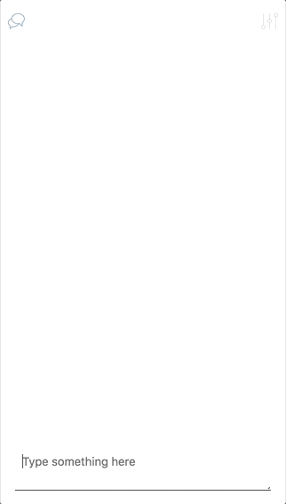

# Livechat
This small application is a chat connected to an SocketIO. Below there's a gif of it working.

  

## Technologies and tools used
* React v16;
* React Router v4;
* React Redux v5;
* Redux v4;
* React Tiny Virtual List v2;
* Ramda v0.25;
* Socket.io v0.9;
* Moment v2;
* i18next v11;
* SCSS;
